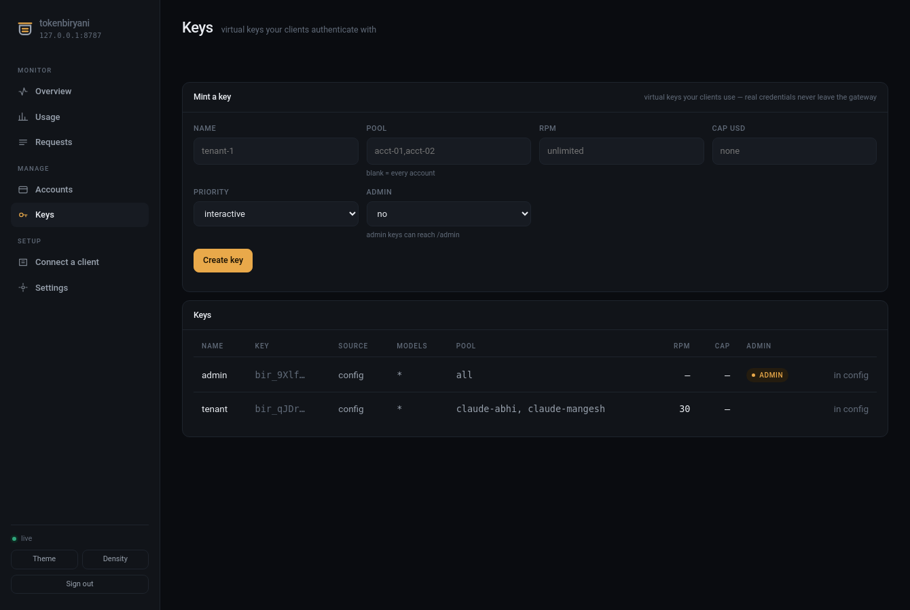

# Operating

## The console

`http://localhost:8787/console` — pool, capacity horizon, live request feed, routing
inspector, per-account detail, key management.

One server-rendered HTML file inside the package: no build step, and no Node toolchain
added to a `pipx install`. The shell carries no data and needs no key; it asks for an
admin key on first load and keeps it in that browser only.

## The CLI

```bash
tokenbiryani status          # the pool
tokenbiryani status --json   # same data, for scripts
tokenbiryani strategies      # what this install can route with
tokenbiryani keygen          # a new virtual key
```

`status` reads `TOKENBIRYANI_URL` and `ANTHROPIC_AUTH_TOKEN`, and respects `NO_COLOR`.

## Endpoints

| | |
|---|---|
| `POST /v1/messages` | Messages API, streaming and not |
| `POST /v1/messages/count_tokens`, `GET /v1/models` | passthrough |
| `GET /healthz` | 200 while any account is ready |
| `GET /console` | the operator console |
| `GET /admin/status` | pool snapshot |
| `GET /admin/accounts/{id}` | one account, with errors by class |
| `GET /admin/requests/{id}` | **why that request went where it did** |
| `GET /admin/horizon` | projected capacity for the next hour |
| `GET /admin/events` | live SSE feed |
| `POST /admin/keys`, `PATCH /admin/keys/{name}`, `DELETE /admin/keys/{name}` | mint, rescope and revoke |
| `GET /admin/settings`, `POST /admin/settings` | read and change routing strategy and price table |
| `PATCH /admin/accounts/{id}`, `DELETE /admin/accounts/{id}/override` | change a config account's operational fields, and hand it back to the file |
| `GET /admin/oauth/detect` | Claude Code logins on this machine — path, subscription, expiry; never the token |
| `POST /admin/reload` | re-read the config file |

## Managing keys at runtime

```bash
curl -sX POST localhost:8787/admin/keys -H "x-api-key: $ADMIN_KEY" \
  -d '{"name":"tenant-1","pool":["acct-02"],"rpm":60,"spend_cap_usd":5}'
```



The plaintext appears **once**, in that response. Minted keys are stored hashed, so a
leaked state store is not a leaked key, and they live in the shared store — one
instance honours a key another minted.

Keys declared in the config file belong to the file; the API will not revoke them.


A key's *scope* can be changed without reissuing it:

```bash
curl -sX PATCH localhost:8787/admin/keys/tenant-1 -H "x-api-key: $ADMIN_KEY" \
  -d '{"pool":["acct-03"],"rpm":null}'
```

Reissuing breaks every client already holding the key, and the usual reason to want a
change is duller than that: a key scoped at an account that has since been removed,
which sits there harmlessly until it blocks the next config reload. `null` clears a
limit; the key material never changes.

## Changing settings without an editor


Two gateway-wide settings can be changed from the console or the API, and are stored
in the state store rather than written back to your config file:

```bash
curl -sX POST localhost:8787/admin/settings -H "x-api-key: $ADMIN_KEY" \
  -d '{"strategy":"cost_tiered"}'
```

They are applied again after every reload, so editing an unrelated line in
`tokenbiryani.yaml` cannot silently revert them, and the Settings screen tags each
value with where it came from — the file, or here. Everything else remains a config
file decision on purpose.

## Accounts the config file declares

The file keeps the credential, the type and the base URL: an override that could
repoint an account at another host would make the file a lie rather than an authority.
What the console *can* change on one — because it is what an operator needs at 3am —
is `enabled`, `name`, `cost_tier`, `priority`, `spend_cap_usd`, `models` and
`max_concurrency`. Those are stored in the gateway, survive a reload, and are undone
in one step:


```bash
curl -sX DELETE localhost:8787/admin/accounts/acct-01/override -H "x-api-key: $ADMIN_KEY"
```

## Request headers

| Header | |
|---|---|
| `X-TokenBiryani-Session` | pin a conversation to one affinity key |
| `X-TokenBiryani-Priority` | `interactive` (default) or `batch` |
| `X-TokenBiryani-Max-Wait` | seconds to wait for capacity |

A client can shorten its own wait budget but never extend it past the operator's
ceiling.

## Privacy

Prompt bodies are **never logged** unless `observability.log_bodies` is explicitly
enabled. Logs carry ids, accounts, tokens, latency and cost — the accounting, not the
content.
